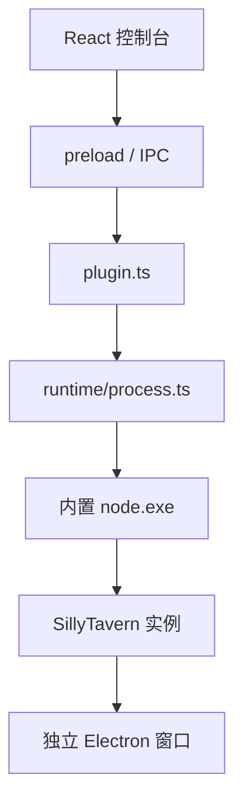

# Windows 架构

Windows 客户端把共享 React 控制台放在管理窗口中，把 SillyTavern 放在独立阅读窗口中。两个窗口连接同一个本地 Node.js 服务。

## 边界

- `main.ts` 只处理应用生命周期、协议和窗口。
- `preload.ts` 暴露受控 IPC，不给页面直接的 Node.js 权限。
- `plugin.ts` 实现共享 `TarvenEnv` 接口并推送进度、日志和状态。
- `runtime/` 负责实例目录、下载、解压、依赖安装和子进程。

控制台关闭阅读窗口时不终止服务。进程生命周期由实例操作控制，窗口生命周期不能顺带删除实例数据。

## 可再生输入

`frontend-dist/` 来自 Android 仓库中的共享前端源码。`runtime/node/` 来自固定版本的 Node.js 官方 Windows 压缩包。两者都不提交，但打包前必须存在并通过脚本准备。

应用运行时不回退到系统 Node.js，也不从 Android 或其他工作区路径即时加载前端。缺少打包输入时应明确失败，避免开发机上的偶然文件掩盖不完整安装包。

跨仓库关系与发布规则见[主仓库架构文档](https://github.com/CAPTCHAAAAA/SillyClient/blob/main/docs/ARCHITECTURE.md)。
