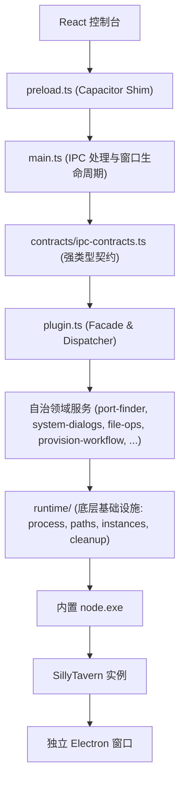

# Windows 架构

> **架构状态：FROZEN（2026-10-09 终态冻结）**  
> 后端已完成钟表级纯净清洗与解耦，详见权威冻结准则：[WINDOWS-BACKEND-ARCHITECTURE-FREEZE.md](WINDOWS-BACKEND-ARCHITECTURE-FREEZE.md)。此分层路线已达最完美形态，**禁止随意更改架构路线**。

Windows 客户端把共享 React 控制台放在管理窗口中，把 SillyTavern 放在独立阅读窗口中。两个窗口连接同一个本地 Node.js 服务。

```mermaid
flowchart TD
    UI["React 控制台"] --> Preload["preload.ts (Capacitor Shim)"]
    Preload --> Main["main.ts (IPC 处理与窗口生命周期)"]
    Main --> Contracts["contracts/ipc-contracts.ts (强类型契约)"]
    Contracts --> Plugin["plugin.ts (Facade & Dispatcher)"]
    Plugin --> Domains["自治领域服务 (port-finder, system-dialogs, file-ops, provision-workflow, ...)"]
    Domains --> Runtime["runtime/ (底层基础设施: process, paths, instances, cleanup)"]
    Runtime --> Node["内置 node.exe"]
    Node --> Server["SillyTavern 实例"]
    Server --> Reader["独立 Electron 窗口"]
```

## 边界

- `main.ts` 只处理应用生命周期、协议和窗口视图，不包含业务实现；拔除历史弱类型断言。
- `preload.ts` 暴露受控 IPC，通过强类型协议交互，不给页面直接的 Node.js 权限。
- `contracts/ipc-contracts.ts` 严格规范 40+ 项强类型请求/响应契约，与前端 1:1 对齐。
- `plugin.ts` 纯净门面与调度器（代码量严格受限在约 280 行），负责全局调度，不内联长业务。
- 独立领域服务（`src/*.ts`）实现具体业务闭环，自治高内聚。
- `runtime/` 负责实例目录、持久注册表、底层子进程与加密存储等基础设施。

控制台关闭阅读窗口时不终止服务。进程生命周期由实例操作控制，窗口生命周期不能顺带删除实例数据。

运行时职责现进一步分为操作协调、实例仓储、归属明确的异步进程监督、安全清理、
迁移事务、有界日志、依赖安装恢复和共享配置查询。取消、删除与回滚共享实例/操作标识，
不通过端口猜测进程归属；整目录回滚验证内容归属，主题回滚只恢复未被后续修改的文件。
接口、数据保护边界与隔离测试说明见 [RUNTIME-HARDENING.md](RUNTIME-HARDENING.md)。

## 远程连接认证

远程实例可以配置 HTTP Basic Auth。共享 React 控制台只持久化“已配置”状态和用户名，不保存密码。`remote-auth.ts` 使用 Electron `safeStorage` 加密凭据，并把密文保存在应用 `userData` 目录；`plugin.ts` 负责原生预检，认证头只会发送给初始地址及其同源重定向。

应用内阅读窗口通过 Electron `login` 事件响应目标源的认证挑战，不处理代理认证，也不会把密码拼入 URL。选择系统浏览器打开时不向浏览器传递凭据，由浏览器自行请求认证。删除远程实例会同步清除密文记录；公网地址应优先使用 HTTPS。

## 可再生输入

`frontend-dist/` 来自本仓库 Windows 适配前端源码 `web/capacitor-ui/`。`frontend.lock.json` 记录其源码与
构建摘要，Windows 适配仍通过同一套 `TarvenEnv` 接口完成，不在本仓库维护第二套 React
页面。`runtime/node/` 来自固定版本的 Node.js 官方 Windows 压缩包。构建输入在打包前
必须存在并通过脚本准备。

应用运行时不回退到系统 Node.js，也不从 Android 或其他工作区路径即时加载前端。缺少打包输入时应明确失败，避免开发机上的偶然文件掩盖不完整安装包。

跨仓库关系与发布规则见[主仓库架构文档](https://github.com/CAPTCHAAAAA/SillyClient/blob/main/docs/ARCHITECTURE.md)。
